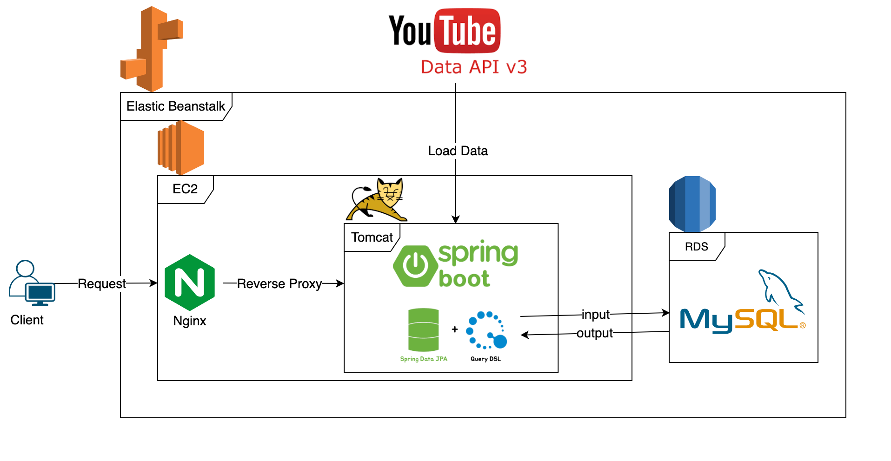

# My YouTube

YouTube Data API 를 사용하여 인기 급상승 동영상을 제공합니다.
카테고리 별 분류, 과거 데이터를 조회할 수 있습니다.

### 시스템 아키텍처

### 사용 기술
- java 17
- spring boot 2.7
- mysql
- spring data jpa, query dsl
- javascript
- thymeleaf
- bootstrap

### 도메인
http://My-youtube3-env.eba-3n4k9nhd.ap-northeast-2.elasticbeanstalk.com
